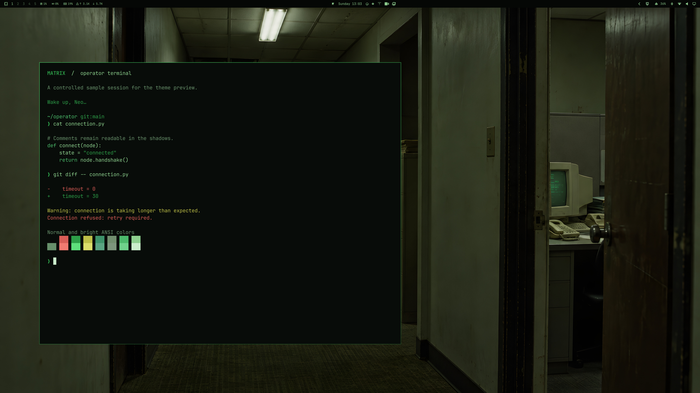

# Matrix

An Omarchy 4 (Quattro) theme for the 1999 film.

Phosphor green on void black, with olive shadows. The accent is CRT green
(`#3CBF5C`), with brighter highlights reserved for the code-rain wallpapers.



Live Omarchy 4 desktop, captured at 3840×2160 and 150% display scaling. The
optional Ghostty profile is shown at 14pt with phosphor glow and sample text.

## Install

Omarchy 4:

```sh
omarchy theme install https://github.com/BVisagie/omarchy-matrix-theme
```

Or *Install > Style > Theme* in the Omarchy menu (`Super + Space`) and paste that URL.

Backgrounds cycle with `Super + Ctrl + Space`.

The base theme contains colors, shell styling, and static backgrounds. The
[optional operator terminal](#operator-terminal) is launched separately.

Compatibility: targets **Omarchy 4 / Quickshell**, checked against the installed
**4.0.0.alpha** templates and desktop. Omarchy 3's Waybar/Mako setup is not
covered by these overrides. The published theme remains **Matrix**; the local
development copy used for these screenshots was named **Matrix Operator**.

## Palette

| Role | Hex | In the film |
| --- | --- | --- |
| Background | `#080C09` | The simulation's black, with a green lift |
| Accent | `#3CBF5C` | CRT phosphor, not the rain's white-hot head |
| Foreground | `#8BC98C` | Terminal text, the body of the stream |
| Muted | `#678D6A` | Readable comments and secondary text |
| Selection | `#23482A` | Highlighted code |
| Red | `#D15D57` | The pill, the alarm, ACCESS DENIED |
| Yellow | `#B8BA48` | Sickly fluorescent |
| Cyan | `#4BB56A` | Prompt, still in-world |

Syntax highlighting stays inside that world: phosphor greens, a brick
red, a little teal for directories and the prompt. No magenta nightclub.

Comments, normal red, and muted syntax each exceed 4.5:1 contrast against both
the main background and lifted panel background. Decorative rain remains dimmer.

## Operator terminal

From this repository, or after `cd ~/.config/omarchy/themes/matrix` for an
installed copy:

```sh
./scripts/matrix-terminal
./scripts/matrix-terminal --terminal foot
./scripts/matrix-terminal --font-size 12
./scripts/matrix-terminal --phosphor
```

Requires Python 3.11+, Ghostty or Foot, and JetBrainsMono Nerd Font. The default
is Ghostty. The launcher reads `colors.toml` directly, so it can preview the
palette before the desktop theme is applied. It keeps your normal terminal
configuration and overrides appearance for this session: 11pt type, additional
padding, an opaque background, and a steady block cursor. Ghostty also gets a
little extra line spacing and runs in a separate instance.

The companion Starship prompt shows directory, Git state, slow command duration,
and failed exit codes. SSH hosts and root sessions stay identifiable. Omarchy's
usual shell startup initializes Starship; custom shells need their own Starship
initialization. `STARSHIP_CONFIG` is scoped to the launched process and its
children. No shell startup files, default terminal, or keybindings are edited.

`--phosphor` enables a small static glow in Ghostty. It adds no animation loop,
flicker, warping, or cursor trails. Foot uses the clean profile. Close the preview
window and open your normal terminal to return to your existing setup.

Run a specific command with arguments after `--`, or request the greeting by hand:

```sh
./scripts/matrix-terminal -- btop
./scripts/matrix-greeting
```

Alacritty and Kitty still receive the base palette through Omarchy. This first
iteration's optional launcher supports Ghostty and Foot.

The launcher uses the documented [Ghostty configuration options](https://ghostty.org/docs/config/reference)
and [Starship prompt configuration](https://starship.rs/config/).

## Shell

The `shell.*.toml` files style the bar, controls, launcher, menus, notifications,
popups, tooltips, and lock input. Panels are opaque near-black; selected rows have
a readable green fill; keyboard focus gets a distinct 2px green border. User
font scaling remains inherited. Omarchy shares the bar's red active token among
recording, updates, and other attention states.

Omarchy replaces entire sections when applying these files, so overridden
sections include their supported defaults explicitly. Global user shell overrides
can still take precedence. No shell plugins or Hyprland behavior are installed.

## Backgrounds

All six are **3840×2160**.

1. **Falling code** — layered Matrix-green rain (first in the theme's cycle)
2. **Mono rain** — the same composition in white phosphor
3. **Green street** — empty city, rain, CRT color grade
4. **The office** — cubicles, CRTs, fluorescent
5. **Hotel corridor** — 1999 carpet, rain on the far window
6. **After Hours** — a worn back-office corridor, tired fluorescents, a CRT through an open door

Rain wallpapers are drawn at native 4K from complete halfwidth katakana and digits,
with smaller distant streams, sparse bright heads, a quieter center, and subtle
static scanlines and glow. The renderer fits actual glyph ink into pixel-sized
cells to avoid clipping. Both palettes use seed `1999` for the same composition.
The street, office, and hotel stills were super-resolved from their 1280×720
masters with Real-ESRGAN. After Hours was generated at 1672×941, upscaled with
the photographic `realesrgan-x4plus` model, then downsampled and blended with the
source resize to retain texture. These are upscaled artworks, not native 4K
generations.

### Rebuild the rain

On Arch, the renderer uses `python-cairo`, `python-gobject`, `python-pillow`,
`pango`, and `noto-fonts-cjk`. Install those dependencies through your normal
package manager if needed. Pillow also handles the final JPEG export, at quality
95 with chroma subsampling disabled. No separate conversion step is needed.

```sh
# Reproduce the two shipped 4K JPEGs (overwrites only those filenames).
python scripts/render_rain.py

# Render other layouts outside the theme's background cycle.
python scripts/render_rain.py /tmp/matrix-ultrawide --width 3440 --height 1440
python scripts/render_rain.py /tmp/matrix-portrait --width 2160 --height 3840
python scripts/render_rain.py /tmp/matrix-clean --scanlines 0 --bloom 0 --format png
```

`--cell`, `--density`, `--quiet`, `--seed`, and `--palette` allow further tuning.
Repeated runs with the same options and rendering libraries are deterministic;
font or library versions can affect pixels. Keep experimental PNGs in a separate
directory to avoid duplicate entries in Omarchy's background cycle.

## Lock screen

This theme styles the lock input with readable placeholder text, green focus,
and a red error state. It does not replace the lock design or authentication.

The earlier preview used a separately installed custom design named `my-rain`
from Lock Screen Explorer. That design is **not bundled** and the name is not a
stock dependency. A portable animated lock companion is planned separately;
installing this theme alone provides the lock colors, not animated rain.

## What it themes

Omarchy generates the rest from `colors.toml` when the theme is applied:

- Omarchy shell (bar, menus, notifications, OSD, lock chrome)
- Alacritty, Foot, Ghostty, Kitty
- Neovim (Aether), Helix, VS Code, Obsidian
- btop, Chromium
- Hyprland active border
- Keyboard RGB (`3CBF5C`)
- Icons: `Yaru-olive-dark`

## Validation

```sh
python -m unittest discover -s tests -v
./scripts/matrix-terminal --check
./scripts/matrix-terminal --terminal foot --check
./scripts/matrix-terminal --phosphor --check
```

The GitHub Actions workflow checks unclipped glyphs, seeded exports, JPEG/portrait
output, every shipped wallpaper's 4K dimensions, palette contrast and aliases,
shell colors, argument handling, invalid renderer input, and GLSL compilation.
The shader test requires `glslangValidator` and skips locally if it is absent;
CI installs it. Terminal `--check` commands validate configs without opening a window.

Local validation uses Omarchy 4.0.0.alpha, Ghostty 1.3.1, Foot 1.28.0, and Starship
1.26.0. Repository staging was exercised in an isolated directory, including the
generated terminal configs and shell overrides. Desktop review covers the menu,
lock preview, terminal profiles, and Ghostty glow on an AMD Radeon RX 7900 XTX.
Rendering on other GPUs and display scales may differ.

## License

MIT. The cinematic stills are original generations. The rain is original
code. The unlock mark is the Omarchy geometry recolored to phosphor green.
