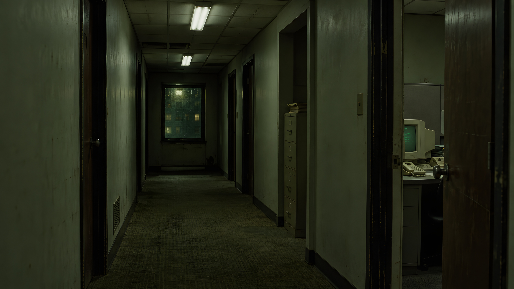

# Wallpaper review — 2026-09-13

Reviewed the five existing wallpapers as full compositions and through native-pixel crops.
All decode successfully as 3840×2160 RGB JPEGs. This is a visual quality review,
not a claim that a large pixel count recovers detail from a smaller source.

| Wallpaper | Native-pixel findings | Recommendation |
| --- | --- | --- |
| Falling code | Complete glyphs, distinct near and distant streams, controlled highlights, and quiet space behind windows. Layer intersections are deliberate. No obvious JPEG blocks or sharpening halos in the inspected areas. | Keep. The native-resolution renderer is preferable to upscaling or sharpening it. |
| Mono rain | Same sound geometry as the green rain. Dimmer perceived contrast is appropriate for the quieter white-phosphor variant. | Keep as the subdued alternative. |
| Green street | Strong perspective, convincing wet-road reflections, and useful dark building surfaces. Some distant window detail is soft; the rainfall makes that relatively unobtrusive. A rounded black frame is baked into the image. | Keep the atmosphere. A future remaster should remove the baked-in frame and refine building detail without sharpening the moving rain. |
| The office | The repeating cubicles and CRTs make this one of the strongest concepts. At 100%, monitor writing becomes smeared blocks, paper markings are incoherent, and some small desk objects look molded together. Several fluorescent tubes carry a distracting pink edge. | Highest priority for a careful reference-based remaster. Preserve the cubicle layout, camera, beige hardware, and empty late-night atmosphere. Improve foreground object geometry and tube color before adding sharpness. |
| Hotel corridor | The strongest spatial composition: the carpet and doors lead naturally to the rain-covered window. Wallpaper stripes, brass fixtures, and carpet hold up reasonably well. Some signage and door markings are malformed, with a baked-in rounded frame and artificial dust/scratches. | Preserve this composition. A conservative remaster should clean the signs and outer frame while retaining the warm brass, olive shadows, and rainy window. Avoid flattening it into uniform green. |

The three cinematic files were previously upscaled from 1280×720 masters, as
documented in the main README. The small-object artifacts are primarily source
detail limitations; increasing sharpness would make several of them more visible.
The existing images were not overwritten during this review.

## After Hours — finished 4K wallpaper



A cramped back-office corridor, tired fluorescents, dark wood doorframes, and a
beige CRT glimpsed through an open office door. The composition preserves dark,
quiet surfaces for application windows and the worn institutional atmosphere of
a late-1990s thriller.

The [original source](after-hours-source.png) was generated with the built-in
image-generation tool at 1672×941. [Exact generation prompt](after-hours-prompt.md).
The final `backgrounds/6-after-hours.jpg` is **3840×2160 RGB**, upscaled with the
photographic `realesrgan-x4plus` model, then downsampled and blended with the source
resize to retain some of its original texture. It is an upscaled artwork, not a
native 4K generation. No extra sharpening was applied.

Native-pixel review compared the doorframes, wall texture, floor, and CRT against
a simple Lanczos resize. The final keeps the original lighting and composition
while improving edge definition. The existing three cinematic wallpapers remain
unchanged; the observations above identify possible future remaster work.

### Reproduce the final export

Use the official [Real-ESRGAN v0.2.5.0 Linux bundle](https://github.com/xinntao/Real-ESRGAN/releases/tag/v0.2.5.0),
`realesrgan-ncnn-vulkan-20220424-ubuntu.zip`, which includes the photographic model.
The binary/model are build tools and are not required to install the theme.

Archive SHA-256:
`e5aa6eb131234b87c0c51f82b89390f5e3e642b7b70f2b9bbe95b6a285a40c96`

Model `.bin` SHA-256:
`713ee713b0353afaa27976f0563a64a5043bd70b9bd8936c2e26e25ebcdbcddf`

From the repository root, with the extracted tool on PATH:

```sh
realesrgan-ncnn-vulkan \
  -i docs/wallpaper-review/after-hours-source.png \
  -o /tmp/after-hours-4x.png \
  -n realesrgan-x4plus -s 4 -t 256 -m /path/to/extracted/models

python - <<'PYTHON'
from PIL import Image, ImageOps

size = (3840, 2160)
source = Image.open("docs/wallpaper-review/after-hours-source.png").convert("RGB")
super_resolved = Image.open("/tmp/after-hours-4x.png").convert("RGB")
source = ImageOps.fit(source, size, method=Image.Resampling.LANCZOS)
super_resolved = ImageOps.fit(super_resolved, size, method=Image.Resampling.LANCZOS)
final = Image.blend(source, super_resolved, 0.70)
final.save("backgrounds/6-after-hours.jpg", quality=95, subsampling=0, optimize=True)
PYTHON
```

The 4× intermediate is 6688×3764. Center fitting trims half a source pixel in
total, shared between the top and bottom, to reach exact 16:9 without stretching.
Pixel-level results may vary with GPU, model runtime, Pillow, and JPEG versions.
